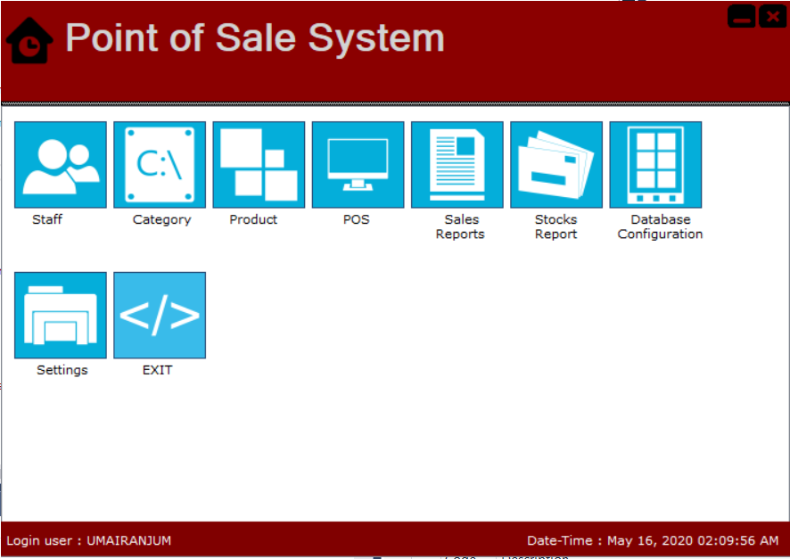

# POS-Application-C#

# Description
The project was developed to solve the problems that are faced in the manual system of all managemants and sale activities performed at Point of Sale/Utility or retail store. Its consist of two panels.

1) Admin Panel
2) POS Panel

# Features 
- Managing Staff
- Product Categories
- Products 
- POS Panel
- Sales Reports 
- Stock Reports

## Admin Panel

## POS Panel

## Contributions 
Contributions, issues and feature requests are welcome.
Feel free to check [issues](https://github.com/UmairAnjum86/POS-App/issues "issues") page if you want to contribute.

## About Me
My name is Umair Anjum, I am Software Engineer at TECHZO Solution Pakistan. I have expertise in Native Android | React - Native| Android | Java | Kotlin | Javascript | MVVM | MVP | RxJava | Dagger | Material Design | Live Data | Data Binding.

- Github : [Umair Anjum ](https://github.com/UmairAnjum86 "Umair Anjum")
- Facebook : [Umair Anjum](facebook.com/umair.anjum.357/ "Umair Anjum")

